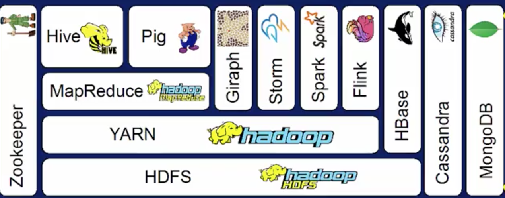

# Big Data Integration & Processing

## Processing Big Data 


###### 1. Big Data Pipelines and High-Level Operations for Big Data Processing

- **Dataflow Approach**
    - **Big Data Pipeline** - Get created to process data through an aggregated set of steps that an be represented with the split, do, merge pattern with data parallel scalability.
        - Stitching together sets of steps together. (Think ``` ls | wc``` in UNIX). Outfit of one running program gets piped into the next program as input. (Functional Programing)
        - The parallelism of each step in the pipeline is mainly data parallelism. 
        - Running the same functions simultaneously for the elements or partitions of a dataset on multiple cores. (e.g Wordcount)

- **Common Data transformations** (Higher order functions to convert one form to another) 
    - ``` map -> ``` Apply the same operation to each member of a collection.
    - ``` reduce -> ``` 'Collecting' things that have the same 'key'.
    - ``` cross/cartesian -> ``` Multiplication. Do some process to each pair from two sets.
    - ``` match/join -> ``` Selective multiplication. Do some process to each pair from two sets, which have the same 'key'.
    - ``` co-group -> ``` Group common items. Collect similar items first, apply a process to each collection.
    - ``` filter -> ``` Select elements that match a criteria (e.g Filter even numbers, x % 2 == 0)
    

- **Aggregations in Big-Data Pipelines** - An operation on a dataset that performs a specific transformation taking all the related data elements into consideration. By choosing the right **aggregation**, you can generate **compact** and **meaningful** insights.
  - ``` sum  ``` - Summation over all the data elements.
  - ``` group-by ``` - Summations for individual data groups. ```(e.g - {color,total}--> (red,5), (yellow,9) ..```
  - ``` average ``` - Average over items of similar types. 
  - ``` max, min, standard deviation ```
  - Connecting Aggregations - ``` max(sum), min(sum), etc.. ```
  - Boolean aggregation - ``` and, or ```
  - Sets - ``` union, intersection, difference ``` 
  - Strings - ``` concatenation ```
  
- **Analytical Operations (ML) in Big Data Pipelines** (Patterns -> Insights -> Decisions) - To analyze the data to discover meaningful trends and patterns in order to gain insights into the problem being studied. 
  - **Classification** - Predict a categorical (discrete values or categories) target from the input data. (e.g binary classification)
    - E.g; Decision Tree Algorithm - Decisions are modeled as a tree structure. 
  - **Clustering** - The goal is to organize similar items into groups of associations. 
    - E.g; K-Means Clustering - Samples are divided into k clusters
  - **Path Analysis** (Graph analytics) - Find routes from one location to another. (e.g shortest path from home to work)
  - **Connectivity Analysis** (Graph analytics) - Finding and tracking groups (communities) to determine interactions between entities. (e.g linkedin network)
  - Etc...

-----


###### 2. Big Data Processing Tools and Systems

- **Overview**
  - Recall the Hadoop Ecosystem higher levels (interactivity) and lower levels (storage and scheduling)
  - 
  - Another way to look at the Hadoop Ecosystem
    - Coordination and Workflow Management
    - Data Integration and Processing
    - Data Management and Storage


- **The Integration and Processing Layer**
  - Evaluation Criteria on developing a big-data pipeline system
    - Execution Model (Batch, Streaming, Interactive Computing)
    - Latency (Time critically)
    - Scalability 
    - Programming Language Support 
    - Fault Tolerance Mechanics 
    
 - **Review of some Big Data Processing Systems**
   - Hadoop MapReduce; 
     - Batch execution model. No in-memory processing. Higher latency, less scalable execution.
     - Java Programming Language. Data Replication is the primary method for fault tolerance.
   - Apache Spark
     - Built to support iterative processing efficiently using a in-memory structure called RDDs
     - Batch & stream processing using disk or memory storage. Low-latency. Scala, Python, Java, R Programming Language.
   - Flink
     - Batch and streaming processing using disk or memory storage. Lower latency framework. 
     - Supports APIs in Java and Scala. Biggest advantage comes from it's optimizer to pick the best pattern in execution strategy
   - Beam (Google)
     - Relatively new system for batch and stream processing. Low-latency. Highly scalable.
     - Java and Scala Programming Language. Python SDK is in the works.
   - Apache Storm
     - Designed for stream processing in real time with very low-latency. 
     - It defined input stream interface abstraction called 'spouts', and computation abstractions called 'bolts'
 
 - **Introduction to Apace Spark**
   - Hadoop MapReduce Shortcomings
     - Only for Map and Reduce based computations. (e.g no Join, Filter, GroupBy functionality for specific datasets)
     - Relies on reading data from HDFS. (Bottleneck, I/O reading data from disks).  
     - Native support for Java only. 
     - No interactive shell support. No support for streaming data processing. 
   
- **Basic of Data Analysis with Spark**
  - Expressive programming model. In-memory processing. Cache and process data in memory, making it faster for iterative applications (10-100x speedup)
  - Support for diverse workloads (stream, batch)
  - Interactive shell (Enables EDA)
  - RDDs are the main programming abstraction in spark. Carry data across many computing notes in parallel, and transform it. 
  - Spark SQL is the component of Spark that provides querying structured and unstructured data through a common query language.
  - Spark Streaming is where data manipulations take place in spark.
  - Provide APIs to convert query results to RDDs in Python, Scala and Java Programs.
  - Spark streaming enables creating small aggregates of data coming from streaming data ingestion systems
    - These aggregate datasets are caled micro-btches and they can be converted into RDBs in Spark for Streaming and processing.
  - 
     
- **Spark Terminology and Architecture Preview**
  - **Resilient Distrubted Datasets (RDDs)**
    - **Dataset;** Come from batch data storage, (hdfs, nosql, text file, kafka streaming, local disks) Generates RDDs (immutable).
    - **Distributed;** Distributed across the cluster of machines. Divided in partitions, atomic chunks of data. Changed dynamically.
    - **Resilient;** Very important in a large scale computing environment. Recover from errors, (e.g node failures, slow process). Track history of each partition.
  - Components
    - **Driver Program;** (Spark Context, sc object) Communicates with the cluster manager to monitor and provision resources. Communicates to worker nodes to submit and execute tasks. 
    - **Worker Node;** Spark Executor (JVM) (Map, Reduce, etc.), Many Big Data Stores and Tools (Bring computation to data)
    - **Cluster Manager;** (YARN/Standalone), Provision, Restart Workers

> [notebooks/spark-example-wc.ipynb - Spark wordcount example using pyspark](notebooks/spark-example-wc.ipynb)

-----
###### Review
> 1. What is data parallelism? Running the same function simultaneously for the partitions of a data set on multiple cores
> 2. Which procedure best generalizes big data procedures? split->do->merge
> 3. Three layers of the Hadoop Ecosystem. Data Integration and Processing, Data Management and Storage, Coordination and Workflow Management
> 4. What are the 5 key points in order to categorize big data systems? Execution model, Latency, Scalability, Programming Language, Fault Tolerance.
> 5. What is the lambda architecture? A type of hybrid data processing architecture
> 6. Which of the following scenarios is an aggregation operations? Counting the total number of data, Average the total number of data, etc.
> 7. What is K-means clustering? Group samples into K clusters.
> 8. What are the layers of Spark? SparkSQL, Spark Streaming, GraphX, Spark Core, MLib. 
> 9. What is in-memory processing? Writing data to memory between pipeline steps.
-----


