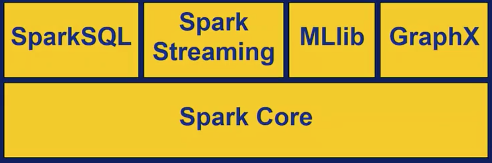

# Big Data Integration & Processing

## Big Data Analytics using Spark


###### Programming in Spark

- RDDs in Pipelines
    - **Create RDDs --> Apply Transformations --> Perform Actions**
    - **Driver Program** defines the **Spark Context** (Create the RDDs which are immutable)
      - Create RDDs from external storage or local collections, like lists.
    - **Worker Node** contains the **Spark Executor** (Managed by a Cluster Manager)
    - Spark uses lazy evaluation for transformations
     - Transformations get computed when an action is executed. (i.e, haskell & erlang)
     - Spark works by **partitions**, and not by elements (mapreduce)

#### Transformations [Web: List of all transformations (Spark 2.0.0)](https://spark.apache.org/docs/2.0.0/programming-guide.html#transformations)
- Remember that RDDs are immutable, meaning they cant be changed in place. 
  - Transformation operation applied to them to get converted into a new RDD.
  - This is essential for keeping track of all the processing.
  - Lazy transformations. (Don't get executed immediately)
  
- Sample Transformations
  - ```map``` - Apply function to each element of RDD (one-to-one transformation) (key-value pair list)
   ```python
    def lower(line):
      return line.lower()
    lower_text_RDD = text_RDD.map(lower)
    ```
  - ```flatMap``` - Map then flatten output. Returns an RDD with an aggregate of all the results.
  ```python
    def split_words(line):
      return line.split()
      
    words_RDD = text_RDD.flatMap(split_words)
    words_RDD.collect()
    ```
  - ```filter``` - Keep only elements where the function is true. Subset of data, or cleaning. Returns elements where the function is true.
  ```python
    def starts_with_a(word):
      return word.lower().startswith("a")
    words_RDD.filter(starts_with_a).collect()
    ```
  - ```coalesce``` - reduce the number of partitions. Simply helps with balancing the data partition numbers and sizes. 
  - ```groupByKey``` - (K,V) pairs => (K, list of all V) - Transformations that combines values with the same key into a list.
  - ```reduceByKey``` - Similar to groupByKey, but uses simple summation to the list of combined values. 
      
> Wide Transformations - In ***wide transformations***, processing depends on data residing in ***multiple partitions*** distributed across worker nodes and this ***requires data shuffling*** over the network.
> Narrow Transformations - ```map, flatMap and filter``` are ***narrow transformations***; where the processing logic depends only on data that is already residing in the partition, and ***data shuffling*** is not necessary.
      
#### Actions [Web: List of all actions (Spark 2.0.0)](https://spark.apache.org/docs/2.0.0/programming-guide.html#actions)
- Actions - RDD operations that trigger the evaluation of the transformation pipeline and return the final result to the driver program, or save result to a presistent storage. 
- Sampe Actions
  - ```collect()``` - Collect will send all the resulting RDDs from the workers, and copy them to the JVM on the Driver Program. 
  - ```take(n)``` - Copies the first ***n*** results of the driver. 
  - ```reduce(func)``` - Aggregate elements with funct (takes 2 elements, return 1)
  - ```saveAsTextFile(filename)``` - Save to local file or HDFS


###### Main Modules in the Spark Ecosystem



- **Spark SQL** - The component of Spark that enables querying structured and unstructured data through a common query language
    - It can connect to many data sources and provide APIs to convert the query results to RDDs in Python, Scala, and Java programs
    - Enables business intelligence tools to connect to Spark using standard connection protocols like JDBC, ODBC.
    - Also provides APIs to convert the query data into DataFrames to hold distributed data.
    ```python
      from pyspark.sql import SQLContext
      sqlContext = SQLContext(sc)
      
      #Read
      df = sqlContext.read.json("/filename.sjon")
      df.show() 
      ```
    
- **Spark Streaming** - Provides scalable processing for **real-time data**, and runs on top of spark-core.
  - Continuous data streams are converted or grouped into **discrete RDDs** which can then be processed in Parallel.
  - Can read data from many different types of resources. Kafka, Flume, HDFS, S3, and other non SQL Databases. Twitter, TCP sockets, etc. (Realtime data providers)
  - Spark streaming reads streaming data, and converts it into *micro batches*, which we call **DStreams** (Discretized stream)
  - Similar to other RDDs, transformations such as map, reduce, and filter can be applied to DStreams. 
    - DStreams can be aggregated into Windows, allowing you to apply computations on sliding windows of data. 
  
- **Spark MLLib** - Scalable **machine learning** library that runs on top of Spark Core. It provides distributed implementations of commonly used machine learning algorithms and utilities. 
  - Algorithms to build models for classification, regression, and clustering. 
  - Techniques for evaluating models, for example, ROC curve, a common statistical technique for plotting the performance of a binary classifier.
  - Statistical functions are also provided. (Summary statistics, means, standard deviation, etc.)
  - Decision Tree Example
  ```python
  from pyspark.mllib.tree import DeceisionTree, DecisionTreeModel
  from pyspark.mllib.util import MLUtils
  
  data = sc.textFile("data.txt")
  
  model = DecisionTree.trainClassifier(parseData, numClasses=2)
  print(model.toDebugString())
  model.save(sc, "decisionTreeModel")
  ```
  - Clustering Example (KMeans)
  ```python
  from pyspark.mllib.clustering import KMeans, KMeansModel
  from numpy import array
  
  data = sc.textFile("data.txt")
  parsedData = data.map(lambda line: array([float(x) for x in line.split(' ')]))
  
  clusters = Kmeans.train(parsedData, k=3)
  
  print(clusters.centers)
  ```
- **Spark GraphX** - Apache Spark's Application Programming Interface for graphs and graph-parallel computation. Uses a property graph model.
  - Property Graph Model; Both nodes and edges in a graph can have attributes and values.
  - Node properties are stored in a vertex table.
  - Edge propensities are stored in a edge table.
  - Connectivity information is stored separately.
  - Built on special RDDs for vertices and edges. (VertexRDD, EdgeRDD) 
  - Triplet view - Logically joins vertex and edge properties. 


###### Hands-on: Data Processing in Spark

> [notebooks/spark-example-tweets.ipynb - Analzying Tweets with Spark](notebooks/spark-example-tweets.ipynb)  
> [notebooks/spark-example-sparksql.ipynb - Exploring SparkSQL and Spark Dataframes](notebooks/spark-example-sparksql.ipynb)  
> [notebooks/spark-example-wc.ipynb - Spark wordcount example using pyspark](notebooks/spark-example-wc.ipynb)  
> [notebooks/spark-example-keamsn.ipynb - Spark mllib example using kmeans and RandomRDDs](notebooks/spark-example-kmeans.ipynb)  
> [notebooks/spark-example-streaming.ipynb - Analzying Sensor Data with Spark Streaming](notebooks/spark-example-streaming.ipynb)  


