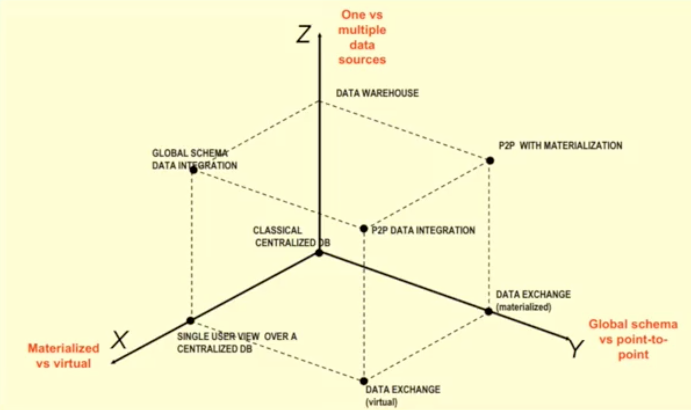

# Big Data Integration & Processing

## Information Integration

###### Overview
Refers to the problem of using many different information sources to accomplish a task.<br>

- **Integrated View** - A relation that is derived by querying two different data sources and combining their results. (A relation computed by other relations)
 
To populate the integrated view, we need to go through a step called **schema mapping**

- **Mapping** - Establish correspondence between the attributes of the view, (target relation) and that of the source relations.


- **Query architecture of the data integration system** - A method for evaluating a query to a data source that has been integrated. 
    - ```Z axis``` - specifies whether we have one data source or multiple data sources.
    - ```Y axis``` - Asks whether there is a single schema or a global schema defined.
    - ```X axis``` - Asks whether the integrated data is actually stored physically in some place or whether it is computed on the fly
        - If it is precomputed, we say that the data is **materialized**
        - If it's computed on the fly, we say it's **virtual**
        
    
        
-----


An obvious goal of an information integration system is to be complete and accurate
- complete - no eligible record from the source should be absent in the target relation
- accurate - all the entries in the integrated relation should be correct. 

<le>

- **Record Linkage problem** - Ensure that the set of data records that belong to a single entity are recognized, perhaps by 
clustering the values of different attributes, or by using a set of matching rules so that we know how to deal with it
during the integration process.
    - Schema mapping problem is a combinatorial challenge. 
    - **Pay-as-you-go-model** - Only integrate sources that are needed when needed. 
    - Paper - [Using Probabilistic Information in Data Integration](http://www.vldb.org/conf/1997/P216.PDF)
    
    