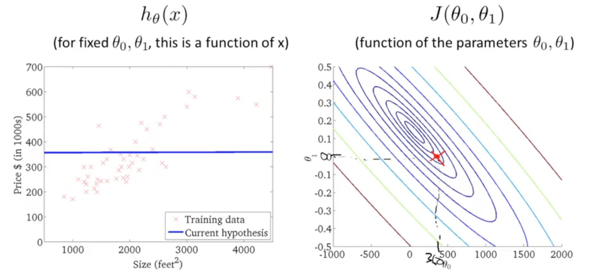
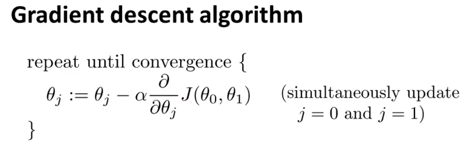

# Machine Learning #
### Introduction (Week 1) ###

> Welcome to Machine Learning! This week, we introduce the core idea of teaching a computer to learn concepts using data—without being explicitly programmed.
  We are going to start by covering linear regression with one variable. Linear regression predicts a real-valued output based on an input value. We discuss the application of linear regression to housing price prediction, present the notion of a cost function, and introduce the gradient descent method for learning.
  We’ll also have optional lessons that provide a refresher on linear algebra concepts. Basic understanding of linear algebra is necessary for the rest of the course, especially as we begin to cover models with multiple variables. If you feel confident in your understanding of linear algebra, feel free to take a break or help other students out in the forums.
  
*"the field of study that gives computers the ability to learn without being explicitly programmed. - Arthur Samuel"* 

#### Welcome ####

| Learning  Algorithm      | Types           |  
| -------------            |:-------------:|
| Supervised Learning (Distinct Labels Given)      | Regression, Classification   | 
| Unsupervised Learning (No Distinct Labels)       | Clustering Analysis         |

- ***Regression*** > Predict results with **continuous** valued output. Map input variables to some continuous function.
- ***Classification*** > Predict a **discrete** valued output, (i.e; 0 or 1). Map input variables into discrete categories.
- ***Clustering*** > Identify **relationships** or **groups** (derive a structure) from the given data. (Note: There is no feedback based on the prediction results)


#### Linear Regression with One Variable ####

**Model Representation:** Generate a hypothesis, **(h)**. - This is considered the function the learning algorithm generates. (i.e, a line).  
> Univariate Linear Regression - One Variable
    
> Notation used in this class:  
> ``` m = number of training examples ```  
> ``` x = "input" variable / features ```  
> ``` y = "output" variable / "target variable ```  
> ``` (x,y) = one training sample ```
    
**Cost Function:** Squared Error Function, or Mean squared Error  
    - Measure the accuracy of our hypothesis function by using a cost function.  
    - This takes an average of all the results of the hypothesis with inputs from x's compared to the actual output y's.  
    - Optimization objective for Linear Regression is to minimize J()  
    - A contour image for the cost function will always look like a bowl shaped, "convex function"
    

    
Contour Plots are sometimes used to visualize the squared error function  




- Gradient Descent



Alpha, is the learning rate. It controls the 'steps'. 
- If alpha is too **small**, gradient descent can be slow.
- If alpha is too **large**, can over shoot the minimum. It may fail to converge, or even diverge.

This is an algorithm to minimize the cost function (J). It utilizes simultaneous updates of variables for convergence. 
  


