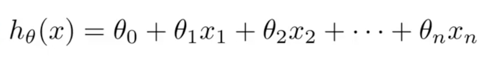
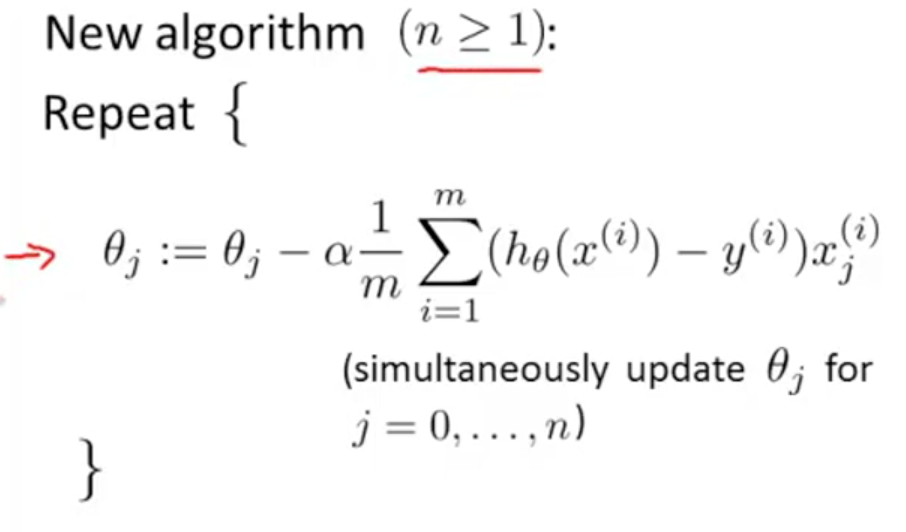

# Machine Learning #
### Introduction (Week 2) ###

> This week we’re covering linear regression with multiple variables. we’ll show how linear regression can be extended to 
accommodate multiple input features. We also discuss best practices for implementing linear regression.
We’re also going to go over how to use Octave. You’ll work on programming assignments designed to help understand how 
to implement the learning algorithms in practice. To complete the programming assignments, you will need to 
use Octave or MATLAB.

#### Linear Regression with Multiple Variables ####

- Multiple features (variables)
  - **Multivariate linear regression**  
  
  - **Gradient Descent for Multiple Variables**  
    
    
  
  
  
  
  
  
  

#### Computing Parameters Analytically ####

