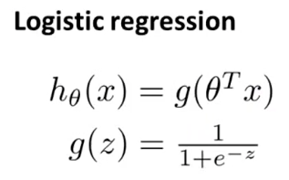
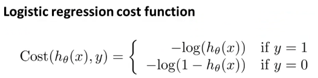

# Machine Learning #

> This week, we’ll be covering logistic regression. Logistic regression is a method for classifying data into discrete outcomes. For example, we might use logistic regression to classify an email as spam or not spam. In this module, we introduce the notion of classification, the cost function for logistic regression, and the application of logistic regression to multi-class classification.
   We are also covering regularization. Machine learning models need to generalize well to new examples that the model has not seen in practice. We’ll introduce regularization, which helps prevent models from overfitting the training data.

Logistic  Regression & Regularization
---

**Classification & Representation**  
- Binary Classification
  - y { 0, 1 }
    - 0: "negative class" (e.g, benign tumor)
    - 1: "positive class" (e.g, malignant tumor)
  - Utilize Logistic Regression, which has a property that the prediction is always between zero and one.
    - Contains the **Sigmoid** function, also known as the **Logistic** function
        - Asymptotes at zero and one.  
    - Construct **decision boundaries**, which are a set of properties that classify what an input will produce.  

**Logistic Regression Model**

- Optimization Objective (Cost function)
  - Choosing the best parameters for _theta_.
  - Algorithms Include;
    - Gradient descent
    - Conjugate gradient
    - BFGS
    - L-BGS
  - Advantages - No need to manually pick alpha, often faster than gradient descent.
  - Disadvantages - More complex
  
>   
>   
>   
  

**Multiclass Classification**

**Regularization**

