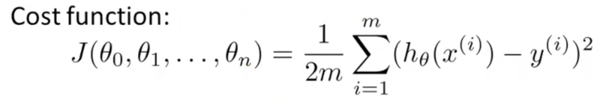

# Machine Learning #

> This week we’re covering linear regression with multiple variables. we’ll show how linear regression can be extended to 
accommodate multiple input features. We also discuss best practices for implementing linear regression.
We’re also going to go over how to use Octave. You’ll work on programming assignments designed to help understand how 
to implement the learning algorithms in practice. To complete the programming assignments, you will need to 
use Octave or MATLAB.

Linear Regression with Multiple Variables
---

- Multiple features (variables)
  - **Multivariate linear regression**  
  
  - **Gradient Descent for Multiple Variables**  
    
    
  
  
  - Feature Scaling 
    - Make sure features are on a similar scale. (Gradient descents can converge more quickly)
    - Feature skill - mathematically, you can find a much more direct path to the global minimum (Think contour plot)
        - Example
          - ```X1 = size (0-2000 ft)``` --> ```X1 = (size / 2000 ft)```
          - ```X2 = number of bedrooms (1-5)``` --> ```X2 = (number of bedrooms / 5)```
    - Mean Normalization - replace ```x.i``` with ```x.i - u.i``` to make features have approximately zero mean.
    
  - Learning Rate
    - (Alpha) is the learning rate. Check by graphing a function as the number of iterations used for gradient descent. 
    - If alpha is too small, you get slow convergence
    - If alpha is too large, J(0) may not decrease on every iteration; may note converge. Slow convergence also possible.
---

  - **Normal Equation** (Alternative to Gradient Descent)
    - For some linear regression problems, this will solve for the optimal value of the parameters theta.
    - Instead of multiple iterations of gradient descent, the normal equation would give us a method to solve for theta analytically. (one step)
    - Octave: ``` pinv(X' * X) * X' * y ```  
    
    
      - **Normal Equation Non-invertibility**
        - What if ```X' * X``` is non-invertible (singular/degenerate matrices)
          - Redudant features, (linear dependent) (e.g. x1 = size in feet, x2 = size in meters)
          - Too many features, ( m <= n) delete some features or use regulation. 
        - Using ```pinv``` instead of ``` inv ``` in octave will solve this issue, even when the matricies are degenerate. 
    
---
 
  - **Gradient Descent**
    - (-) Need to choose alpha
    - (-) Needs many iterations
    - (+) Works well even when n (features) is large.
  - **Normal Equation**
    - (-) Need to compute.. Matrix inversion, (n^3). (X.T*X)^-1 (NxN matrix)
    - (-) Slow if n (features) is large (e.x n > 10,000))
    - (+) No need to chose alpha
    - (+) Don't need to iterate
    
---

[exercise1: Octave - Linear regression, Gradient Descent, Normal Equation, etc.](assignments/machine-learning-ex1)  

---
