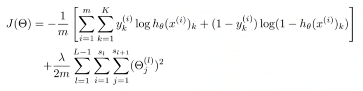

# Machine Learning #
### Neural Networks: Learning (Week 5) ###

> Learning how to train Neural Networks. The Neural Network is one of the most powerful learning algorithms (when a linear classifier doesn't work, this is what I usually turn to), and this week's videos explain the 'backprogagation' algorithm for training these models. In this week's programming assignment, you'll also get to implement this algorithm and see it work for yourself. 

---
##### Cost Function and Backpropagation
- Cost Function


---
##### Backpropagation
1. Apply forward propagation; Allows us to compute the activation values.
2. Compute back propagation; In order to compute the derivatives. Compute ```delta``` term --> "error" in the activation of node ```j``` in each layer, ```l```